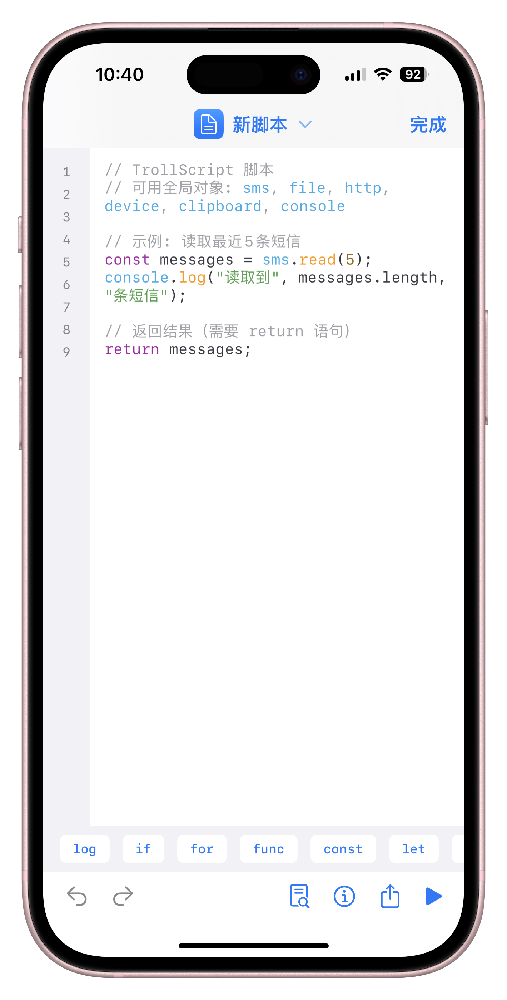

# TrollScript

<p align="center">
  
</p>

<p align="center">
  <strong>基于 TrollStore 的 iOS JavaScript 脚本执行器</strong>
</p>

<p align="center">
  <a href="https://github.com/dompling/TrollScript-Release/releases/latest">
    
  </a>
  
  
  <a href="https://github.com/dompling/TrollScript-Release/releases">
    
  </a>
</p>

---

## 简介

TrollScript 是一款利用 TrollStore 特权的 iOS JavaScript 脚本执行器。通过内置的 JavaScript 运行时，你可以编写和执行各种自动化脚本，访问系统级 API，实现普通 App 无法完成的功能。

## 功能特性

- **脚本管理** - 创建、编辑、删除、导入导出脚本
- **语法高亮** - 内置代码编辑器，支持 JavaScript 语法高亮
- **丰富的 API** - 15+ 原生模块，覆盖网络、位置、通知、媒体等功能
- **通知触发** - 监听指定 App 通知，自动执行脚本
- **iCloud 同步** - 支持 CloudKit 数据库和 iCloud Drive 两种同步模式
- **快捷指令** - 完整 App Intents 支持，可在快捷指令中运行脚本
- **版本更新** - 应用内检测新版本
- **崩溃恢复** - 内置崩溃捕获与恢复机制
- **性能监控** - 实时内存、CPU、FPS 监控

## 系统要求

- iOS 16.0 或更高版本
- 已安装 [TrollStore](https://github.com/opa334/TrollStore)

## 安装方式

### 方式一：直接下载

1. 前往 [Releases](https://github.com/dompling/TrollScript-Release/releases/latest) 页面
2. 下载最新的 `.tipa` 文件
3. 在 TrollStore 中安装

### 方式二：URL Scheme 安装

如果已安装 TrollStore，可以点击以下链接直接安装:

```
apple-magnifier://install?url=https://github.com/dompling/TrollScript-Release/releases/latest/download/TrollScript_latest.tipa
```

## JavaScript API

TrollScript 内置丰富的原生模块，[查看完整中文 API 文档](API.md) [查看完整 English API 文档](API.en.md)。

> [示例脚本 (TrollScript-Store)](https://github.com/dompling/TrollScript-Release/tree/main/templates/TestScripts)

### 基础模块

| 模块 | 功能 |
|------|------|
| `http` | HTTP 请求 (GET/POST/PUT/DELETE) |
| `console` | 控制台输出 |
| `storage` | 数据持久化存储 |
| `clipboard` | 剪贴板读写 |
| `file` | 文件读写操作（沙盒内） |
| `device` | 设备信息获取 |

### 系统功能模块

| 模块 | 功能 |
|------|------|
| `notification` | 本地通知发送与管理 |
| `location` | 位置服务、地理编码 |
| `app` | 应用管理、URL Scheme 调用 |
| `alarm` | 闹钟与定时提醒（基于本地通知） |

### 媒体与数据模块

| 模块 | 功能 |
|------|------|
| `media` | 音乐库访问、播放控制、专辑/艺术家/播放列表管理 |
| `contacts` | 通讯录读写、联系人搜索与分组 |
| `weather` | 天气查询（wttr.in API） |

### 扩展交互模块

| 模块 | 功能 |
|------|------|
| `mail` | 邮件发送、模板管理 |
| `shortcuts` | 快捷指令调用与集成 |

## 高级功能

### iCloud 同步

TrollScript 支持两种 iCloud 同步模式：

1. **文件目录模式**（推荐）
   - 脚本存储在 `iCloud Drive/TrollScript/Scripts/` 目录
   - 可在「文件」App 中直接查看和编辑
   - 支持 `.trollscript` 和 `.js` 格式

2. **数据库模式**
   - 使用 CloudKit + CoreData 同步
   - 自动后台同步，无需手动操作

### 脚本导入/导出

支持两种导出格式：
- `.trollscript` - 完整格式，包含代码和元数据
- `.js` - 纯 JavaScript 代码

导入支持：`.trollscript`、`.js`、`.json`、`.txt` 格式

### 脚本商店

TrollScript 支持脚本商店功能，通过脚本商店可以方便地获取和分享脚本。

[默认商店 (TrollScript-Store)](https://github.com/dompling/TrollScript-Store)

### URL Scheme

TrollScript 支持多种 URL Scheme，可用于从其他应用快速操作：

#### 安装脚本

从 URL 下载并导入脚本：

```
trollscript://install?url=https://example.com/script.js
```

#### 商店安装

从脚本商店直接安装脚本（用于商店一键安装）：

```
trollscript://store?id=脚本ID&name=脚本名称&url=https://example.com/script.js
```

| 参数 | 说明 |
|------|------|
| `id` | 脚本唯一标识（用于版本追踪） |
| `name` | 脚本显示名称 |
| `url` | 脚本下载地址 |

#### 运行脚本

通过脚本 ID 或名称运行已安装的脚本：

```
trollscript://run?id=脚本UUID
trollscript://run?name=脚本名称
```

#### 导入脚本

通过 Base64 编码的内容导入脚本：

```
trollscript://import?content=Base64编码内容&name=脚本名称
```

#### 打开应用

仅打开 TrollScript 应用：

```
trollscript://open
```

#### 添加商店订阅

通过 URL 添加脚本商店订阅源：

```
trollscript://subscribe?name=订阅源名称&url=https://example.com/store.json
```

| 参数 | 说明 |
|------|------|
| `name` | 订阅源显示名称 |
| `url` | 订阅源 JSON 地址 |

### NPM 支持

为了方便开发者编写脚本，提供了 TypeScript 定义包：

[](https://www.npmjs.com/package/@dompling/trollscript-types)

```bash
npm install --save-dev @dompling/trollscript-types
```

## 截图
<p align="center">
  
  
</p>
<p align="center">
  
  
</p>

## 更新日志

查看 [Releases](https://github.com/dompling/TrollScript-Release/releases) 获取完整更新日志。

## 反馈问题

如遇问题，请在 [Issues](https://github.com/dompling/TrollScript-Release/issues) 中反馈。

## 免责声明

- 本项目仅供学习研究使用
- 请勿用于非法用途
- 使用本软件产生的任何后果由用户自行承担

## 致谢

- [TrollStore](https://github.com/opa334/TrollStore)
- [Highlightr](https://github.com/raspu/Highlightr)

---

<p align="center">
  Made with ❤️
</p>
